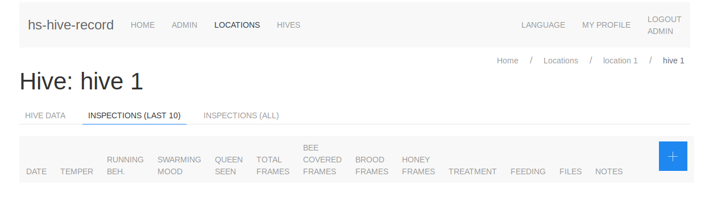

# hs-hive-record
Lightweight beehive record tracking system

- the beekeeper can define different locations where he has hives.
- for ech locacation hives can be defined which also contain the info about the queens
- for a hive inspections can be added with the most important data about the frames, treatment, feeding or swarming behaviour.

Here is an image of the menubar of the app and the inspections list table header.



## Technology
The project uses
- Haskell as programming language
- Yesod web-framework
- RiotJS for DOM-manipulation as a "reactive" GUI
- UIkit for the design elements

## Generate model code

Almost all models are defined in 'hs-generator/src/Main.hs'.
With the 'ginger' template engine the following components are generated:
- handler actions (CRUD)
- models for Yesod entities
- postgres function to feed the history tables on all DB changes

All model definitions and the ginger templates are in the hs-generator subproject.
If model definitions changed you can regenerate the haskell code with
```
cd hs-hive-record
sh run_gen.sh
```


## Run Yesod server
```
cd hs-hive-record
sh run_dev.sh
```


## Initialize admin user
only needed after the first start (please enable the initdb route first)
```
curl http://localhost:3000/initdb/me@example.com
```

you can see the generated password in the yesod logs like
```
[Error] ###############################
[Error] admin login:         admin
[Error] admin password:      XpISNqkWAGFfrlryWxNzbtkvJzFkszVj
[Error] admin password hash: sha256|17|CPlYqS5DBuHSZRtbJjUasQ==|wptBAbVHgSSRnJJ+7X1P6PbsJcM+oZ+JaGjs1xVNJns=
[Error] admin email:         me@example.com
[Error] ###############################
```
thus the generated password of the 'admin' user in this sample is: XpISNqkWAGFfrlryWxNzbtkvJzFkszVj


## Generate new password hashes
normally you set the password on the browser while the server is running
but in case you have to reset them hard in the database
```
sh run_passwd.sh mySecretPassword78574
```

will generate the hash: sha256|17|sm/d6UdH7+nRXZt7bJaAeg==|HVpHzSBOHQPwZiqmfEHiCZZPZh4tFLQyEuDKsNdqcN0=

then you can update the appropriate database row for the admin user or some other user


## Create PostgreSQL database
```
sudo su postgres -c 'createuser --createdb --encrypted --no-inherit --login --pwprompt --no-createrole --no-superuser --no-replication hiverec'
sudo su postgres -c 'createdb --encoding=UTF-8 --owner=my-project --template=template0 hiverec'
```

